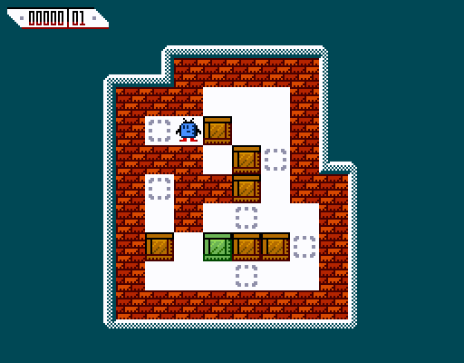

<h1 align="center">
  <b>Raktáros - A puzzle game for PRIMO</b>
</h1>
<p align="center">
  Raktáros is a <a href="https://en.wikipedia.org/wiki/Sokoban">Sokoban</a> clone for the 8-bit home computer <a href="http://primo.homeserver.hu/html/inenglish.html">PRIMO</a>, written in C using <a href="https://z88dk.org/">z88dk</a>.
  <br><br>
  
</p>

## Why?

Even though a version of the PRIMO supporting color graphics was designed alongside the monochrome one, it never went into production. Thanks to the [research](http://primo.homeserver.hu/html/hardverctipus.html) done by the community, the original ROM contents and documentation are available online, so it's possible to build one, and it's also possible to emulate it. However, since it was never sold there's no software for it, so this game was designed to support both the color and monochrome PRIMO to fill this void.

## Gameplay

The game is played on a board of squares, where each square is a floor or a wall. Some floor squares contain boxes, and some floor squares are marked as storage locations.

The player is confined to the board and may move horizontally or vertically onto empty squares (never through walls or boxes). The player can move a box by walking up to it and pushing it to the square beyond. Boxes cannot be pulled, and they cannot be pushed to squares with walls or other boxes. The number of boxes equals the number of storage locations. The puzzle is solved when all boxes are placed at storage locations.

## Controls

- **Q**, **W**, **Up arrow**: move up
- **A**, **Left arrow**: move left
- **S**, **Down arrow**: move down
- **D**, **Right arrow**: move right
- **Space**: restart current level

## Building

If you have [z88dk](https://github.com/z88dk/z88dk/wiki/installation) installed the tape file can be built with:

```
$ make
```

Or if you have docker installed you can build it inside a container without installing z88dk using:

```
$ make docker
```

The resulting tape file will be placed next to the Makefile in both cases.

## License

Raktáros is licensed under the [MIT license](https://github.com/no1msd/raktaros/blob/main/LICENSE).
